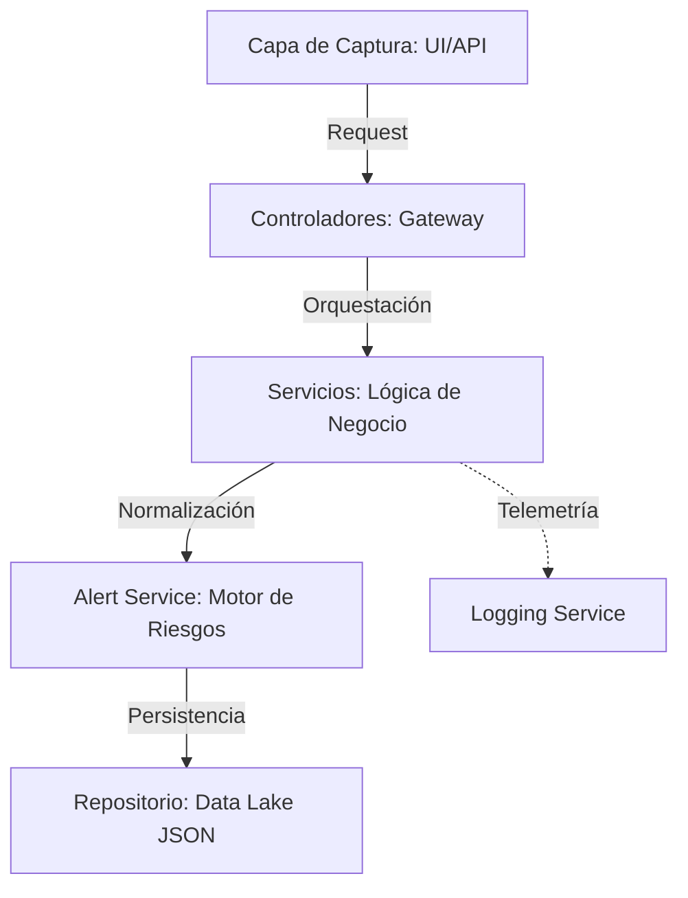

<p align="center">
  
</p>

# 🌍 ClimApp: Inteligencia Climática de Alta Disponibilidad

> **Business Case:** En un mercado global donde el clima dicta la eficiencia operativa, la falta de datos hiperlocales es un riesgo financiero. **ClimApp** nace como una solución B2B diseñada para **DashLogistics**, transformando la incertidumbre climática en activos de decisión mediante un modelo de datos híbrido y trazable.

---

## 💼 Identidad de Producto

| Desafío del Sector | Solución ClimApp |
| :--- | :--- |
| **Zonas de Sombra de Datos** | **Modelo Híbrido:** Combina la precisión masiva de la API de AEMET con la captura manual humana para micro-climas industriales. |
| **Integridad del Dato** | **Validación Estricta:** Implementación de *Guard Clauses* y validación de tipos para evitar la ingesta de ruido o datos corruptos. |
| **Falta de Trazabilidad** | **Telemetría de Auditoría:** Sistema de logs de nivel empresarial que registra el linaje del dato desde la captura hasta el almacenamiento. |

---

## 🏗️ Excelencia Arquitectónica

Hemos implementado una arquitectura de **capas desacopladas** (CSR: Controller-Service-Repository) que garantiza la escalabilidad y facilita el mantenimiento.

### 🛠️ Stack Tecnológico
*   **Core:** Python 3.9+ & Flask (Agilidad y eficiencia en microservicios).
*   **Resiliencia:** Protocolos de *Location Failover* (GPS > Geo-Coding > IP Inferred).
*   **Persistencia:** JSON dinámico para portabilidad total y futura migración a SQL.

### 🗺️ Patrón de Flujo de Datos


---

## 📜 El Contrato de Datos (Single Source of Truth)

Para **DashLogistics**, la procedencia es tan importante como el valor. Nuestro esquema garantiza que cada registro sea único y auditable.

### 🔍 Diccionario de Datos
*   `id`: Identificador único (UUID v4) para evitar colisiones en la sincronización.
*   `fuente`: Campo crítico de **Data Lineage**. Diferencia si el dato es `Manual` o `API_AEMET` para análisis de sesgos.
*   `alertas`: Array de riesgos detectados automáticamente por el motor de reglas.

### ⚠️ Protocolos de Seguridad (Umbrales de Alerta)

El sistema evalúa en tiempo real los siguientes límites técnicos para disparar protocolos de seguridad:

| Parámetro | Umbral | Alerta | Acción Sugerida |
| :--- | :--- | :--- | :--- |
| **Temperatura** | **≥ 40.0°C** | 🔴 **ROJA** | Parada operativa por estrés térmico. |
| **Temperatura** | **≥ 35.0°C** | 🟠 **NARANJA** | Hidratación y descansos obligatorios. |
| **Temperatura** | **≤ 0.0°C** | ❄️ **HELADA** | Riesgo en pavimentos y fluidos. |
| **Viento** | **> 70.0 km/h** | 🌪️ **VIENTO** | Asegurar carga y estructuras. |
| **Lluvia** | **> 30.0 mm** | 🌧️ **INTENSA** | Revisión de drenajes y logística. |

---

## 🛠️ Ingeniería de Calidad & Telemetría

### 🧪 QA & Blindaje contra Regresiones
Utilizamos **Pytest** con una cobertura del 100% en las rutas críticas del repositorio. 
*   **Mocking:** Simulamos respuestas de AEMET para testear el comportamiento del sistema en condiciones de red extremas.
*   **Resultados:** Actualmente **7/7 tests PASSED**, garantizando que cada refactorización mantiene la integridad del sistema.

```bash
# Comando de ejecución de auditoría técnica
pytest tests/ -v
```

### 🛰️ Telemetría y Diagnóstico (app.log)
El archivo `logs/app.log` no es solo un registro; es nuestro panel de diagnóstico en producción. Implementamos niveles de severidad (`INFO`, `WARNING`, `ERROR`, `CRITICAL`) para:
*   Detectar fallos en la API Key de AEMET.
*   Monitorear el éxito del *Failover* de ubicación.
*   Auditar quién y cuándo realiza registros manuales.

---

## 👥 Roles y Metodología (Agile Focus)

El equipo operó bajo un marco **SCRUM**, gestionando ramas de Git para evitar conflictos y asegurando una integración continua mediante Pull Requests revisadas.

*   **Adriana (Gateway & UX):** Arquitecta del punto de entrada (`app.py`) y la experiencia del usuario final.
*   **Isabela (Modelado & Validaciones):** Responsable de la integridad de los datos de entrada y modelos de negocio.
*   **Elena (API & Normalización):** Especialista en integraciones externas y el motor de alertas inteligentes.
*   **Juan (Infraestructura & QA):** Lideró la capa de persistencia, el sistema de logs y la suite de pruebas unitarias.

---

## 🚀 Roadmap de Evolución

- [ ] **Fase 2:** Migración del Repositorio a **SQLite** para gestión de Big Data climático.
- [ ] **Fase 3:** Dashboard analítico con **visualización avanzada** (Gráficos de tendencia y mapas de calor).
- [ ] **Fase 4:** Integración de modelos de **Machine Learning** para predicción de alertas preventivas.

---
<p align="center">
  <b>© 2026 DashLogistics - ClimApp Team</b><br>
  <i>"Transformando datos atmosféricos en certeza operativa."</i>
</p>
